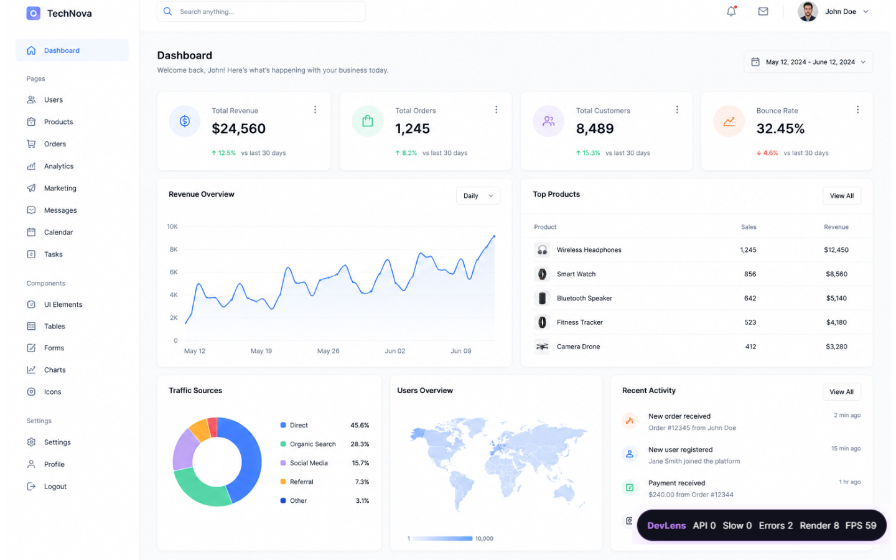
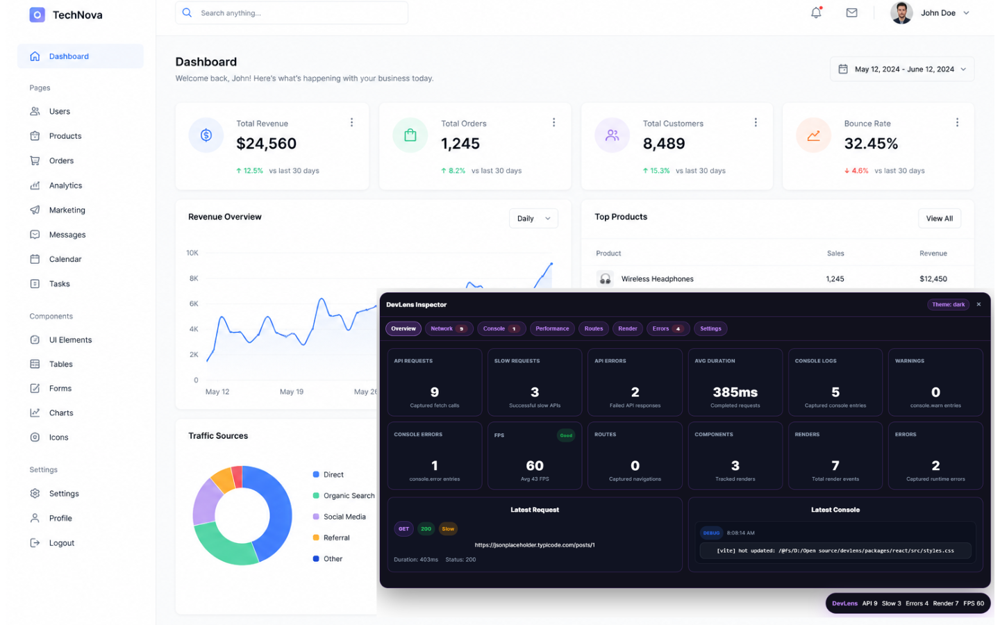
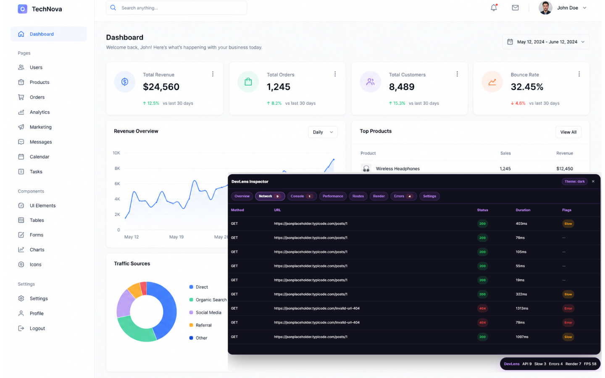

# DevLens

**See what your app is really doing.**

DevLens is a modern Laravel Debugbar-inspired debugging and performance inspection toolkit for React and Next.js applications.

It provides a lightweight in-app developer inspector for monitoring:

- API requests
- console logs
- runtime errors
- component renders
- route changes
- FPS and long tasks
- application performance

Created by **Noore Rabbi Shagor** under **CodeNRS**.

---

# Screenshots

## Floating Debugbar



---

## Overview Panel



---

## Network Details



---

# Features

- Floating developer debugbar
- Expandable inspector drawer
- Network request monitoring
- Console log/warn/error tracking
- Runtime error monitoring
- FPS and long task monitoring
- Route navigation tracking
- Component render tracking
- React error boundary tracking
- React support
- Next.js App Router support
- Next.js Pages Router support
- Dark, light, and system themes
- Development-first lightweight runtime design
- Zero configuration setup
- Safe development-only runtime behavior

---

# Installation

## React

Using pnpm:

```bash
pnpm add @nrshagor/devlens-react
```

Using npm:

```bash
npm install @nrshagor/devlens-react
```

Using yarn:

```bash
yarn add @nrshagor/devlens-react
```

---

## Next.js

Using pnpm:

```bash
pnpm add @nrshagor/devlens-next
```

Using npm:

```bash
npm install @nrshagor/devlens-next
```

Using yarn:

```bash
yarn add @nrshagor/devlens-next
```

---

# React Setup

Add DevLens inside your main application component.

```tsx
import { DevLens } from '@nrshagor/devlens-react';
import '@nrshagor/devlens-react/styles.css';

export function App() {
  return (
    <>
      <YourApp />
      <DevLens />
    </>
  );
}
```

---

# Next.js Setup

## 1. Create a client component

Create:

```txt
components/devlens-client.tsx
```

```tsx
'use client';

import { NextDevLens } from '@nrshagor/devlens-next';
import '@nrshagor/devlens-next/styles.css';

export function DevLensClient() {
  return <NextDevLens />;
}
```

---

## 2. Add DevLens to your application

### App Router (`app/layout.tsx`)

```tsx
import { DevLensClient } from '@/components/devlens-client';

export default function RootLayout({ children }: { children: React.ReactNode }) {
  return (
    <html lang="en">
      <body>
        {children}
        <DevLensClient />
      </body>
    </html>
  );
}
```

---

### Pages Router (`pages/_app.tsx`)

```tsx
import type { AppProps } from 'next/app';
import { DevLensClient } from '@/components/devlens-client';

export default function App({ Component, pageProps }: AppProps) {
  return (
    <>
      <Component {...pageProps} />
      <DevLensClient />
    </>
  );
}
```

---

# Render Tracking

Render tracking is opt-in to keep DevLens lightweight.

```tsx
import { useDevLensRender } from '@nrshagor/devlens-react';

function ProductCard() {
  useDevLensRender('ProductCard');

  return <div>Product</div>;
}
```

---

# Error Boundary Tracking

```tsx
import { DevLensErrorBoundary } from '@nrshagor/devlens-react';

export function App() {
  return (
    <DevLensErrorBoundary fallback={<p>Something went wrong.</p>}>
      <YourApp />
    </DevLensErrorBoundary>
  );
}
```

---

# Philosophy

DevLens should be:

- invisible by default
- powerful when expanded
- lightweight
- fast
- developer friendly

DevLens should never feel bloated, intrusive, or difficult to set up.

---

# NPM Packages

- `@nrshagor/devlens-react`
- `@nrshagor/devlens-next`
- `@nrshagor/devlens-ui`
- `@nrshagor/devlens-core`
- `@nrshagor/devlens-shared`

---

# License

AGPL-3.0-only
